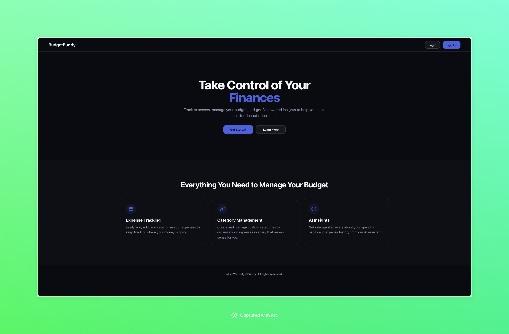
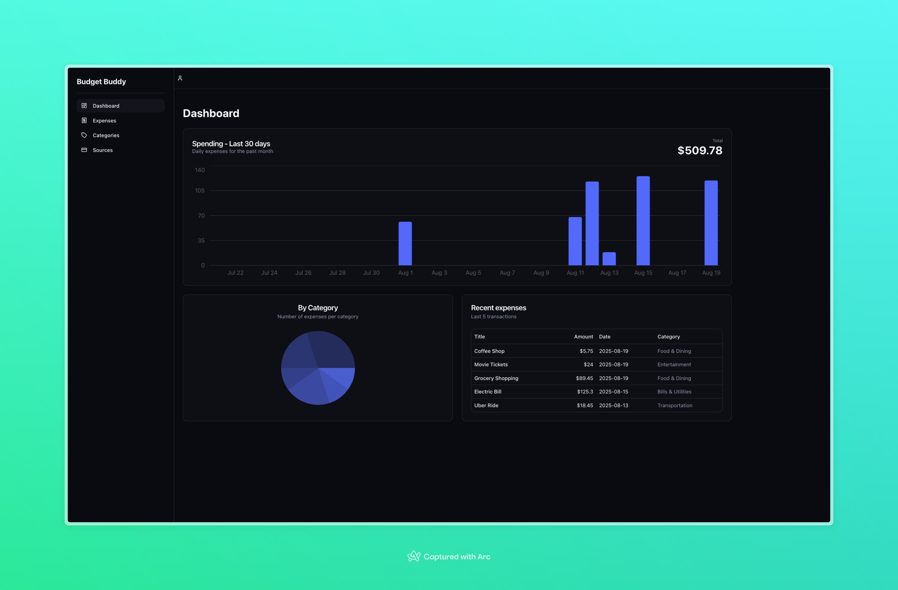
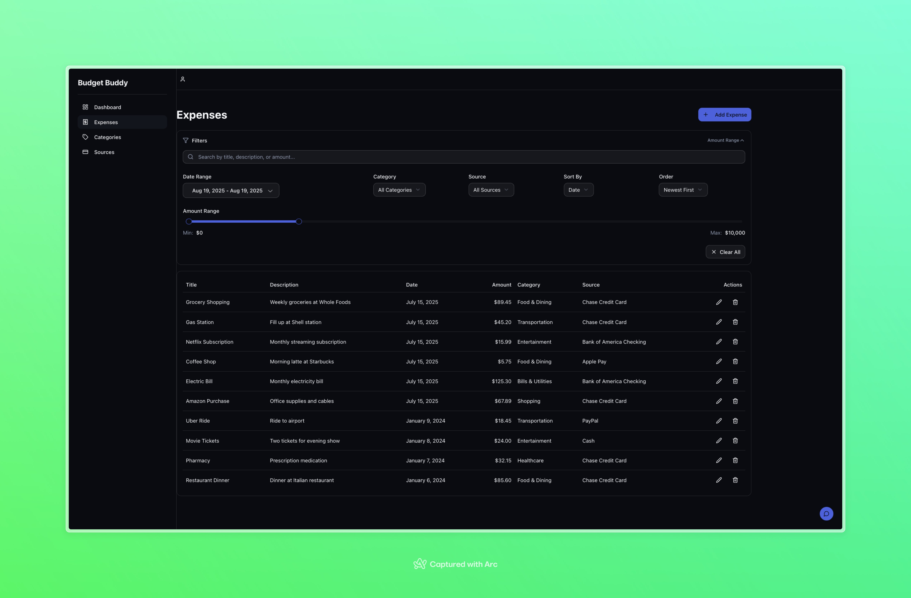
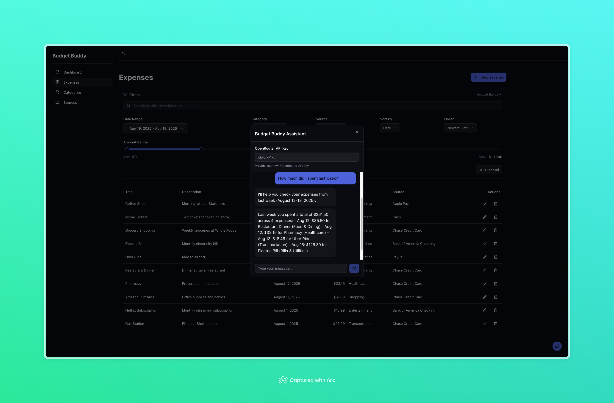

# BudgetBuddy

## Table of Contents

- [Project Description](#project-description)
- [Tech Stack](#tech-stack)
- [Getting Started Locally](#getting-started-locally)
- [Available Scripts](#available-scripts)
- [Project Scope](#project-scope)
- [Screenshots](#screenshots)
- [Project Status](#project-status)
- [License](#license)

## Project Description

BudgetBuddy is an intuitive expense management application that allows users to add, edit, delete, and filter expenses. With an integrated AI assistant, users can ask questions about their expense history and receive quick insights and summaries. Additionally, the application supports the management of expense categories and sources, ensuring a streamlined approach to tracking personal finances.

## Tech Stack

**Frontend:**

- Next.js 15 (with turbopack)
- React 19
- TypeScript 5
- Tailwind CSS 4
- shadcn/ui
- AI SDk

**Backend:**

- Supabase

**AI Integration:**

- Openrouter.ai

## Getting Started Locally

1. Ensure you have Node.js version `22.14.0` installed (as specified in the .nvmrc file).
2. Clone the repository:
   ```bash
   git clone <repository-url>
   cd budget-buddy
   ```
3. Install the dependencies:
   ```bash
   npm install
   ```
4. Start the development server:
   ```bash
   npm run dev
   ```
5. Open [http://localhost:3000](http://localhost:3000) in your browser to view the application.

## Available Scripts

- `npm run dev`: Starts the development server using Next.js and turbopack.
- `npm run build`: Builds the application for production.
- `npm run start`: Runs the production server.
- `npm run lint`: Analyzes the code for linting issues using ESLint.
- `npm run lint:fix`: Automatically fixes linting issues where possible.
- `npm run format`: Formats the codebase using Prettier.
- `npm run prepare`: Sets up Git hooks using husky.

## Project Scope

BudgetBuddy is designed to provide a comprehensive solution for managing personal expenses. It offers:

- **Expense Management:** Easily add, edit, delete, and filter expenses with strict validation rules.
- **Category & Source Management:** Organize expenses by managing custom categories and sources.
- **AI Assistant:** Interact with an AI-powered assistant for real-time insights into expense history.
- **Secure Access:** Ensure that users have private and secure access to their financial data.

## Screenshots

### Landing Page


_Welcome screen showcasing the application's main features and benefits_

### Dashboard Overview


_Main dashboard view with expense analytics and visual charts for better financial insights_

### Expense Management


_Comprehensive expense list with advanced filtering options to easily track and manage your spending_

### AI Assistant


_Interactive AI-powered assistant providing real-time insights and answering questions about your expense history_

## Project Status

This project is under active development. New features and improvements are continuously being implemented as outlined in the product requirements document (PRD).

## License

Distributed under the MIT License. See `LICENSE` for more information.
